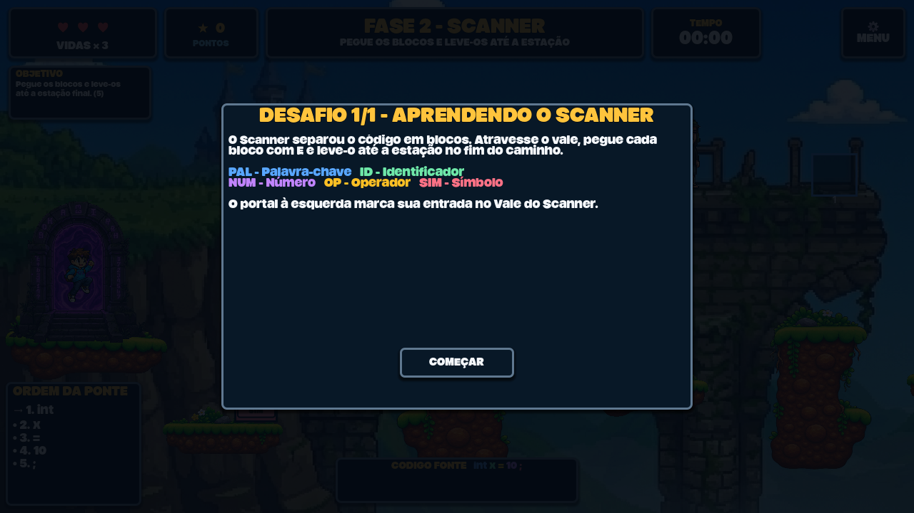
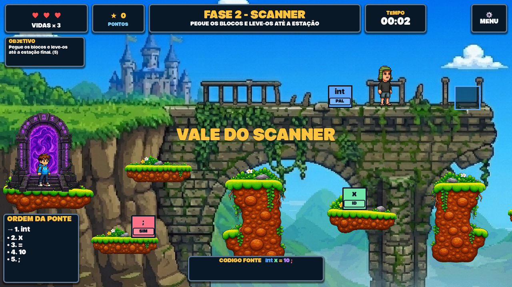
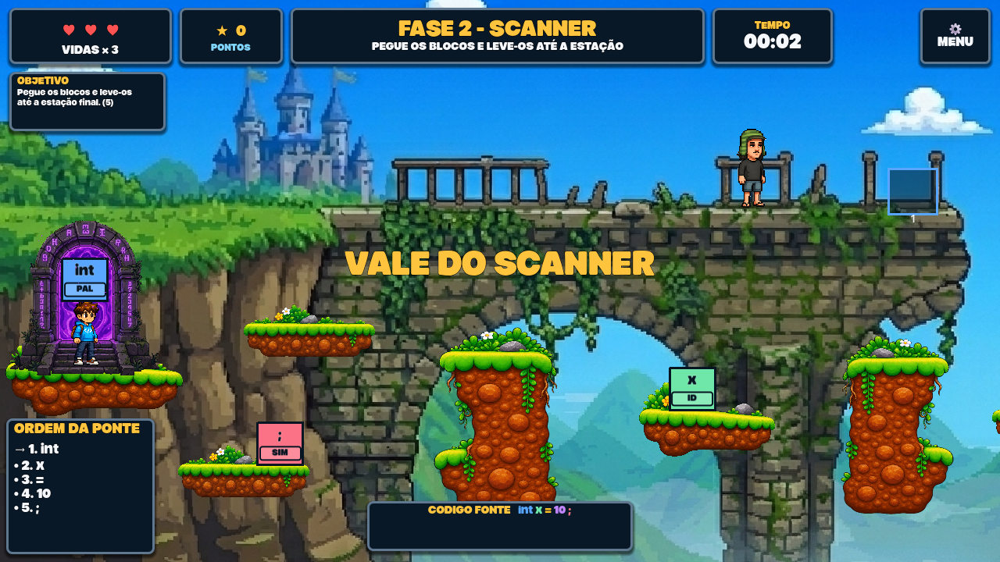
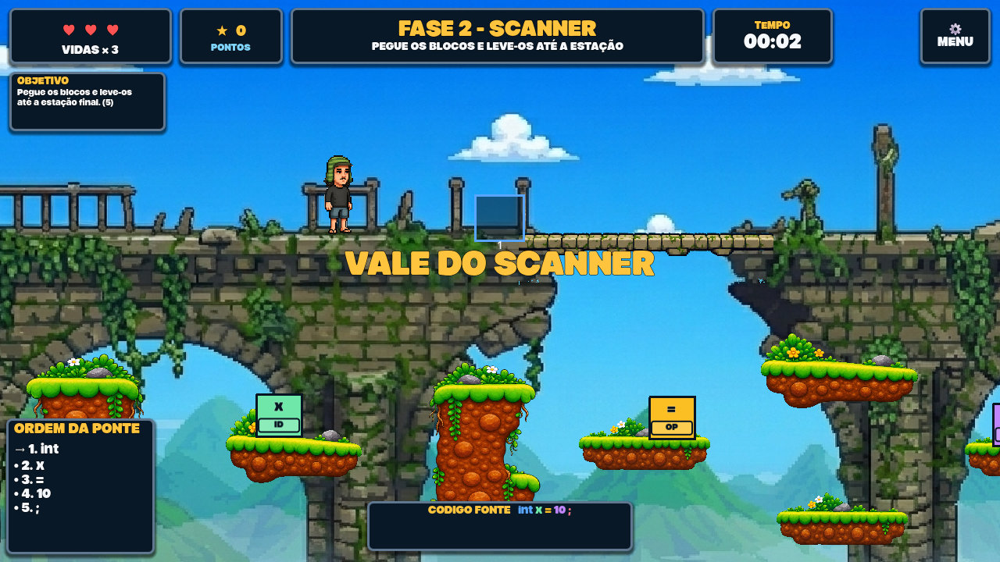
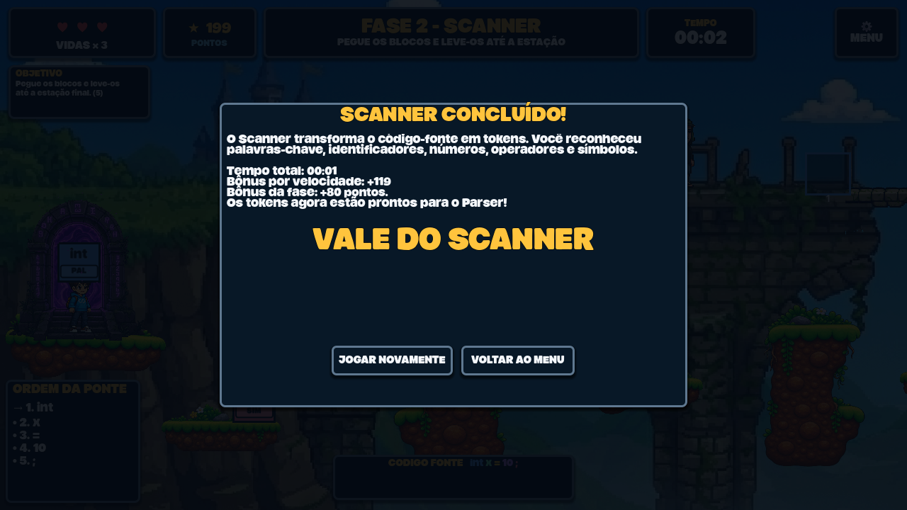

# 📸 Evidências AEX do Grupo 2: Fase 2, Vale do Scanner

> **Projeto:** Compiler Edu Game, Atividade Curricular de Extensão (AEX)
> **Curso:** Ciência da Computação, UENP
> **Disciplina:** Compiladores
> **Professor Orientador:** Prof. Luciano Rovanni
> **Período:** 2026/2
> **Grupo:** 2, responsável pela Fase 2 (Vale do Scanner)
> **Período de desenvolvimento:** 03/08/2026 a 29/08/2026
> **Documento elaborado por:** Pedro Gomes e Caio Nogueira (Documentação)

Este documento reúne as evidências de desenvolvimento e de extensão da Fase 2, seguindo o [Guia de Evidências AEX](aex_evidencias.md). A documentação técnica da fase está em [docs/fases/fase2_scanner.md](fases/fase2_scanner.md).

---

## 1. 👥 Identificação da Equipe

| Integrante | Função | Contribuição principal na Fase 2 |
|---|---|---|
| Pedro Carulla | Líder | Planejamento, divisão de tarefas, acompanhamento das entregas e integração no GitHub |
| José Neres | Conteúdo Pedagógico | Definição do conceito léxico, escolha do código-fonte do desafio e redação didática |
| Eduardo Mattos | Conteúdo Pedagógico | Explicações dos tokens, textos de dica, objetivo e tela de conclusão |
| Felipe Muraro | Interface (UI/UX) | Modelagem da cena, arte do vale, blocos de token, ponte e integração com o HUD |
| Richard Ribeiro | Interface (UI/UX) | Composição visual do cenário, paleta por categoria léxica e ajustes de legibilidade |
| Heitor Vidal | Programação | Mecânica de carregar/entregar blocos, progresso da ponte, portais e limpeza de assets |
| Gustavo Favorin | Programação | Lógica de sequenciamento léxico, integração com `GameManager` e `SoundManager` |
| Filipe Sudário | Testes / QA | Plano de testes, execução da bateria headless e testes manuais de jogabilidade |
| Pedro Gomes | Documentação | Documento de engenharia da fase e organização das evidências AEX |
| Caio Nogueira | Documentação | Levantamento de requisitos documentados, matriz de rastreabilidade e revisão |

---

## 2. 💻 Evidências de Desenvolvimento de Software

### 2.1 Histórico de commits do grupo

Repositório: `compiler-edu-game` · Branch de trabalho: `origin/fase2` · Integração: `main`

Usuários GitHub do grupo: `Oaluah` (Heitor Vidal) e `gitmuraro` (Felipe Muraro).

| Data | Autor (usuário) | Commit | Descrição |
|---|---|---|---|
| 11/08/2026 | Felipe Muraro (`gitmuraro`) | `b7d1dab` | feat: implementa Fase 2 Scanner e progressão global |
| 13/08/2026 | Felipe Muraro (`gitmuraro`) | `163b730` | fase 2: ajustes de cenário, plataformas e arte |
| 24/08/2026 | Heitor Vidal (`Oaluah`) | `55b499e` | Deletar código inútil |
| 24/08/2026 | Heitor Vidal (`Oaluah`) | `2bf273a` … `9ca18f2` | Limpeza de assets não utilizados (11 commits de remoção) |
| 24/08/2026 | Heitor Vidal (`Oaluah`) | `ae65104` | Commit da fase 2 (talvez final) |
| 24/08/2026 | Heitor Vidal (`Oaluah`) | `477502e` | Merge da branch `origin/fase2` |
| 25/08/2026 | Heitor Vidal (`Oaluah`) | `43ad074` | Fase 2: versão final integrada à `main` |

Somando tudo: 18 commits, com 2.876 linhas adicionadas e 224 removidas nos diretórios da Fase 2.

Comandos para reproduzir os números acima:

```bash
git log --all --author=aluah --author=Muraro --author=Heitor --format='%h %an %ad %s' --date=short
```

```bash
git log --all --author=aluah --author=Muraro --pretty=tformat: --numstat -- scenes/fase2_scanner scripts/fase2_scanner assets/fase2_scanner tests
```

### 2.2 Artefatos produzidos

| Tipo | Caminho | Quantidade |
|---|---|---|
| Cenas Godot | `scenes/fase2_scanner/` | 8 cenas (`main`, `token_block`, `bridge_slot`, `alignment_rack`, `portal`, `editable_platform`, `scanner_token`, `bridge_student_npc`) |
| Scripts GDScript | `scripts/fase2_scanner/` | 12 arquivos, ~956 linhas |
| Assets visuais | `assets/fase2_scanner/` | 28 imagens (cenário, ponte, personagem carregando, NPC, portal) |
| Testes | `tests/headless_scanner_test.gd`, `tests/visual_phase2_capture.gd` (+ `.tscn`) | 3 arquivos |
| Documentação | `docs/fases/fase2_scanner.md`, `docs/evidencias_fase2.md` | 2 documentos |

### 2.3 Registro dos testes automatizados

```bash
godot --headless --script tests/headless_scanner_test.gd
```

Saída obtida (execução em 30/08/2026, Godot 4.7.2, código de saída `0`):

```text
PASS: scanner, pontuação, rollback e vidas
```

A bateria tem 4 suítes e cobre 7 dos 20 casos de teste da fase:

1. Sequência léxica do desafio 1, em que o token antecipado é rejeitado e a ordem correta conclui;
2. Identificadores duplicados (`x` em `if (x > 10) return x;`) são equivalentes entre si;
3. Pontuação com combo progressivo, criação de checkpoint e rollback;
4. Consumo das três vidas e emissão única do sinal `game_over`.

Os outros 13 casos foram validados em teste manual de jogabilidade pela equipe de QA. O plano completo está na seção 5 de [fases/fase2_scanner.md](fases/fase2_scanner.md).

### 2.4 Registro visual da fase

A cena `tests/visual_phase2_capture.tscn` percorre os estados visuais da fase e salva as imagens em disco:

```bash
godot --path . tests/visual_phase2_capture.tscn -- --capture-dir=docs/img
```

O processo imprime uma linha `Captura salva: ...` por imagem e encerra sozinho. Sem o argumento `--capture-dir=`, a mesma cena apenas abre a fase para inspeção visual manual.

> **Observação:** a captura precisa de renderização real e não funciona com `--headless`. Na primeira execução em uma máquina nova, rode antes o passo de importação de assets: `godot --path . --headless --import`.

Capturas geradas em 30/08/2026 com Godot 4.7.2:

#### Tela de introdução com o conceito e a legenda das categorias



Evidencia **RP-01** e **RP-02**: o jogador recebe a definição das cinco categorias léxicas (`PAL`, `ID`, `NUM`, `OP`, `SIM`) antes de qualquer ação.

#### Vale do Scanner com os blocos distribuídos pelas plataformas



Evidencia **RF-08** e **RP-08**: HUD com vidas, pontuação e tempo; painel "ORDEM DA PONTE" indicando a sequência esperada; barra de código-fonte colorida por categoria; blocos `int` (PAL, azul), `x` (ID, verde) e `;` (SIM, vermelho) visíveis no cenário.

#### Jogador carregando um bloco



Evidencia **RF-02**: o bloco `int` fixado acima da cabeça do personagem, na pose de transporte.

#### Ponte parcialmente montada (1/5 encaixes)


Evidencia **RF-04**: com apenas o primeiro token entregue, um único segmento é ativado e a passarela termina no meio do vão. A travessia continua impossível.

#### Ponte completa



Evidencia **RF-06**: com os cinco segmentos ativos a travessia fica contínua, a barreira é removida e o portal de saída é habilitado.

#### Tela de conclusão



Evidencia **RF-07**, **RF-13** e **RP-07**: pontuação final, bônus por velocidade, bônus da fase e o texto que liga o Scanner ao Parser.

| Evidência | Arquivo | Status |
|---|---|---|
| Tela de introdução com a legenda das categorias | `docs/img/fase2_intro.png` | ✅ gerada |
| Vale com os blocos espalhados nas plataformas | `docs/img/fase2_vale.png` | ✅ gerada |
| Jogador carregando um bloco (`E`) | `docs/img/fase2_carregando.png` | ✅ gerada |
| Ponte parcialmente montada (1/5 encaixes) | `docs/img/fase2_ponte_parcial.png` | ✅ gerada |
| Ponte completa e portal de saída ativo | `docs/img/fase2_ponte_completa.png` | ✅ gerada |
| Tela de conclusão com a pontuação | `docs/img/fase2_conclusao.png` | ✅ gerada |

---

## 3. 🗓️ Registro de Reuniões e Planejamento

Preencha uma linha por reunião do grupo e anexe a ata ou o print da conversa quando houver.

| Data | Duração | Participantes | Pauta / Decisões | Anexo |
|---|---|---|---|---|
| | | | | |
| | | | | |
| | | | | |

---

## 4. 🏫 Oficina de Extensão com a Comunidade

> **Status: ainda não realizada.** A ficha abaixo segue o modelo do [Guia de Evidências AEX](aex_evidencias.md) e deve ser preenchida logo após a aplicação.

### 4.1 Checklist de preparação

- [ ] Definir a instituição parceira e a data da aplicação
- [ ] Obter autorização da direção da escola/instituição
- [ ] Preparar **termo de autorização de uso de imagem** para os participantes (menores: assinatura do responsável)
- [ ] Imprimir a **lista de presença** com nome, série/turma e assinatura
- [ ] Preparar o build do jogo nas máquinas do laboratório (ou pen drive com o executável)
- [ ] Montar o formulário de avaliação (Google Forms ou papel) com as perguntas da seção 4.4
- [ ] Definir quem do grupo conduz a apresentação, quem dá suporte técnico e quem registra fotos
- [ ] Testar a Fase 2 nas máquinas do local antes da oficina

### 4.2 Ficha do relatório de atividade de extensão

```markdown
# 📝 Relatório de Atividade de Extensão do Grupo 2 (Fase 2: Vale do Scanner)

**Data:** ___/___/2026
**Horário:** ___h___ às ___h___
**Local/Instituição:** ______________________________________
**Público-Alvo:** ______________________ (ex: 1º ano do Ensino Médio)
**Nº de participantes:** ______
**Equipe Responsável presente:** ______________________________________

---

### 1. Resumo da Atividade
(Ex: apresentação teórica de 15 min sobre o que é um compilador e o que é um token,
seguida de 45 min de jogo com foco nas Fases 1 e 2, e 15 min de discussão final.)

### 2. Feedback dos Participantes
- **O que os participantes mais gostaram na Fase 2?**
- **Entenderam a regra de ordem dos tokens sem explicação adicional?** (Sim / Parcialmente / Não)
- **Quais conceitos acharam mais difíceis?**
- **Principais dúvidas ou erros observados durante a partida:**
- **Quantos concluíram a Fase 2 sem perder vidas?** ______ de ______

### 3. Observações da Equipe sobre a Jogabilidade
- Tempo médio para concluir a Fase 2: ______
- Erro mais frequente:
- Jogadores usaram o botão de dica? Quantas vezes em média?
- Dificuldades de controle (pulo, pegar bloco, atravessar plataformas):

### 4. Sugestões de Melhorias para o Jogo
- [ ]
- [ ]
- [ ]

### 5. Anexos
- [ ] Lista de presença assinada
- [ ] Termos de autorização de uso de imagem
- [ ] Fotos da aplicação
- [ ] Resultados do formulário de avaliação
```

### 4.3 Registros fotográficos

| Evidência | Arquivo/Link | Status |
|---|---|---|
| Foto da apresentação inicial | | ☐ pendente |
| Foto dos participantes jogando | | ☐ pendente |
| Foto da equipe do Grupo 2 na atividade | | ☐ pendente |
| Lista de presença digitalizada | | ☐ pendente |
| Termos de autorização de imagem | | ☐ pendente |

### 4.4 Formulário de avaliação aplicado aos jogadores

Perguntas do Grupo 2, que complementam o modelo geral do guia AEX:

1. Você já conhecia o conceito de Compiladores ou Programação antes de jogar? *(Sim / Não / Um pouco)*
2. Antes de jogar, você sabia o que é um token? *(Sim / Não)*
3. Depois de jogar a Fase 2, você conseguiria explicar o que um Scanner faz? *(Escala 1 a 5)*
4. Ficou claro por que os blocos precisam ser entregues em uma ordem específica? *(Escala 1 a 5)*
5. As cores das categorias (palavra-chave, identificador, número, operador, símbolo) ajudaram a entender? *(Escala 1 a 5)*
6. A Fase 2 foi: *(Muito fácil / Fácil / Equilibrada / Difícil / Muito difícil)*
7. O que foi mais difícil: entender o conceito ou controlar o personagem? *(Conceito / Controle / Nenhum dos dois)*
8. Qual fase achou mais divertida?
9. Deixe seu comentário ou sugestão para a equipe!

---

## 5. 📊 Consolidação dos Resultados

Preencha esta tabela depois da oficina.

| Indicador | Meta | Resultado |
|---|---|---|
| Participantes atingidos | | |
| Taxa de conclusão da Fase 2 | | |
| Média da pergunta 3 (compreensão do Scanner) | ≥ 4,0 | |
| Média da pergunta 4 (clareza da ordem dos tokens) | ≥ 4,0 | |
| Sugestões de melhoria coletadas | | |
| Ajustes implementados a partir do feedback | | |

---

## 6. 🔗 Referências

- [Guia de Evidências AEX](aex_evidencias.md)
- [Documentação de Engenharia da Fase 2](fases/fase2_scanner.md)
- [Guia de Testes](guia_testes.md)
- [Manual das Equipes](manual_equipes.md)
- [README principal do projeto](../README.md)
