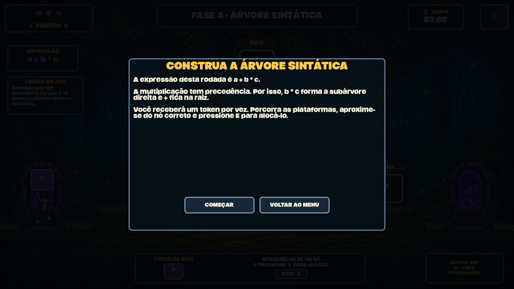
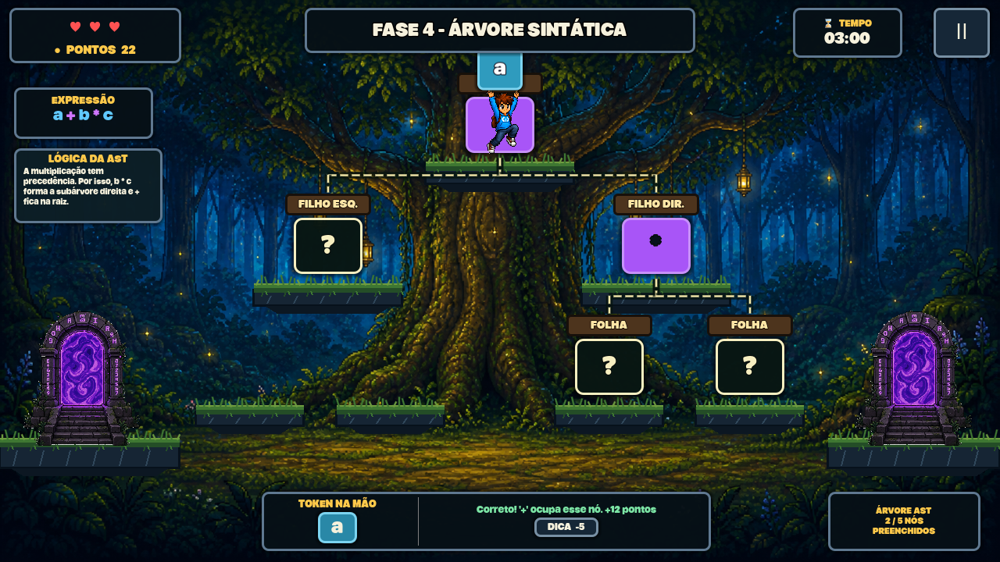
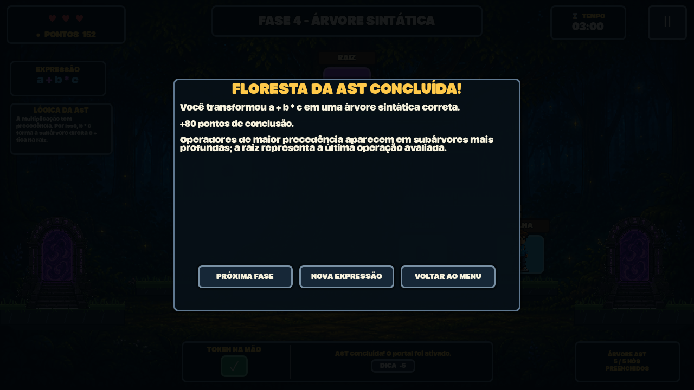

# Evidências AEX — Grupo 6: Floresta da AST

> **Projeto:** Compiler Edu Game — Atividade Curricular de Extensão
> **Curso:** Ciência da Computação, UENP
> **Disciplina:** Compiladores
> **Professor orientador:** Prof. Luciano Rovanni
> **Grupo:** 6 — Fase 4, Floresta da Árvore Sintática
> **Documento técnico:** [README.md](README.md)
> **Última atualização:** 02/09/2026

Este documento reúne as evidências técnicas disponíveis e os formulários para registrar a aplicação da Fase 4 junto à comunidade externa. Campos sobre oficinas e participantes permanecem em branco quando não há comprovação no repositório.

---

## 1. Identificação da equipe

| Integrante | Função | Contribuição na Fase 4 |
|---|---|---|
| Marcelo Sousa | Líder | Liderança, organização e acompanhamento das entregas |
| Arthur Francisco | Programação | Implementação e manutenção da mecânica em GDScript |
| Nicolas Ribeiro | Interface | Interface, composição visual e experiência do jogador |
| Gustavo do Valle | Interface | Interface, composição visual e experiência do jogador |
| Pedro Selleti | Conteúdo | Conteúdo pedagógico sobre AST, precedência e feedbacks |
| Gabriel Ramos | Testes / QA | Planejamento e execução dos testes da fase |
| Rafael Cunha | Documentação / AEX | Documento técnico e organização das evidências |

**Equipe completa do Grupo 6:** Arthur Francisco, Rafael Cunha, Gabriel Ramos, Marcelo Sousa, Gustavo do Valle, Nicolas Ribeiro e Pedro Selleti.

---

## 2. Evidências de desenvolvimento

### 2.1 Histórico verificável

| Data | Commit | Autor | Evidência |
|---|---|---|---|
| 11/08/2026 | `961a1e3` | Pedro Selleti | Implementação inicial da Fase 4 |
| 13/08/2026 | `c6ed7a9` | Pedro Selleti (`pselleti`) | Reformulação como desafio de AST |
| 27/08/2026 | `e55dec7` | Pedro Selleti (`pselleti`) | Áudio, portais, animações, card e jogabilidade |
| 01/09/2026 | `8545152` | Luciano Rovanni do Nascimento | Estrutura inicial de documentação |
| 02/09/2026 | Pendente de commit | Trabalho local | Ligação com a Fase 5 e documentação completa |

### 2.2 Artefatos produzidos

| Tipo | Caminho | Status |
|---|---|---|
| Cena principal | `scenes/fase4_ast/Main.tscn` | ✅ Implementada |
| Cenas auxiliares | `scenes/fase4_ast/jogador.tscn`, `hud.tscn`, `no_ast.tscn` | ✅ Implementadas |
| Scripts específicos | `scripts/fase4_ast/` | ✅ 7 scripts |
| Fundo e portal | `assets/fase4_ast/` | ✅ Incluídos |
| Áudio ambiente | `assets/audio/phase4_forest_at_night.wav` | ✅ Incluído |
| Teste da AST | `tests/headless_ast_test.gd` | ✅ Automatizado |
| Teste de colisões | `tests/phase4_collision_test.gd` | ✅ Automatizado |
| Gerador de capturas | `tests/visual_phase4_capture.gd` | ✅ Automatizado com renderização |

### 2.3 Testes internos

```powershell
godot --headless --path . --script res://tests/headless_ast_test.gd
godot --headless --path . res://tests/phase4_collision_test.tscn
```

Saída obtida em 02/09/2026 com Godot 4.7:

```text
PASS: lógica da AST, precedência e alocação de tokens
PASS: colisões e pousos da Fase 4
```

Os testes cobrem construção de `a + b * c`, rejeição sem consumo do token, pouso e alinhamento dos pés, queda pelos vãos, descida com `S`/`↓` e entrada animada pelos portais.

### 2.4 Como regenerar as imagens

As capturas exigem renderização real; não usar `--headless`:

```powershell
godot --path . res://tests/visual_phase4_capture.tscn -- --capture-dir=docs/fase4_ast/img
```

O teste percorre automaticamente introdução, AST parcialmente preenchida e conclusão.

---

## 3. Registro visual da Fase 4

### 3.1 Introdução e apresentação do conceito



Evidencia **RF-02**, **RP-01** e **RP-02**: expressão, explicação da precedência, instruções e estrutura da árvore ao fundo.

### 3.2 Gameplay e construção parcial



Evidencia **RF-03**, **RF-04**, **RF-06**, **RF-08** e **RF-11**: personagem com token, nós rotulados, caminhos hierárquicos, nós preenchidos, plataformas e HUD.

### 3.3 Conclusão



Evidencia **RF-13**, **RF-14**, **RF-15** e **RP-09**: AST concluída, bônus e opções de próxima fase, nova expressão e menu.

| Evidência | Arquivo | Status |
|---|---|---|
| Introdução da AST | `docs/fase4_ast/img/intro_arvore.png` | ✅ Gerada |
| Gameplay / árvore parcial | `docs/fase4_ast/img/gameplay.png` | ✅ Gerada |
| Tela de conclusão | `docs/fase4_ast/img/conclusao.png` | ✅ Gerada |

---

## 4. Registro de reuniões

Não foram encontradas atas específicas do Grupo 6. Adicionar uma linha por reunião e anexar o registro quando disponível.

| Data | Duração | Participantes | Pauta, decisões e tarefas | Anexo |
|---|---|---|---|---|
| A preencher | | | | |

---

## 5. Oficina de extensão

> **Status documental:** não há registro de oficina da Fase 4 no repositório até 02/09/2026. Preencher esta seção depois da aplicação; os campos abaixo não representam uma atividade já realizada.

### 5.1 Checklist de preparação

- [ ] Definir instituição, data, horário e público-alvo
- [ ] Obter autorização da instituição
- [ ] Preparar termos de uso de imagem; para menores, obter autorização do responsável
- [ ] Preparar lista de presença
- [ ] Testar a Fase 4 nas máquinas do local
- [ ] Verificar áudio, controles e resolução
- [ ] Definir responsáveis pela explicação, suporte, observação e fotos
- [ ] Preparar formulário digital ou impresso
- [ ] Oferecer alternativa sem registro facial a quem não autorizar imagem

### 5.2 Roteiro sugerido

| Etapa | Duração | Atividade |
|---|---:|---|
| Contextualização | 10 min | Explicar expressão, operador, operando e precedência. |
| Demonstração | 5 min | Mostrar raiz, filhos e folhas em um exemplo simples. |
| Jogo | 20–30 min | Participantes jogam individualmente ou em duplas. |
| Discussão | 10 min | Comparar as quatro expressões e suas árvores. |
| Avaliação | 5 min | Aplicar questionário e coletar sugestões. |

### 5.3 Modelo de relatório da atividade

```markdown
# Relatório de Atividade de Extensão — Grupo 6 / Floresta da AST

**Data:** ___/___/2026
**Horário:** ___h___ às ___h___
**Local/Instituição:** ______________________________________
**Público-alvo:** ___________________________________________
**Número de participantes:** ______
**Equipe presente:** ________________________________________

## Resumo da atividade
(Descrever apresentação, tempo de jogo, organização e discussão.)

## Resultados observados
- Participantes que concluíram: ______ de ______
- Tempo médio de conclusão: __________________
- Expressão com mais erros: __________________
- Nó com mais erros: raiz / filho esquerdo / filho direito / folha
- Média de dicas utilizadas: __________________

## Feedback
- Aspectos mais elogiados:
- Conceitos considerados difíceis:
- Dificuldades de controle:
- Sugestões de melhoria:

## Anexos
- [ ] Lista de presença
- [ ] Autorizações de imagem
- [ ] Fotografias
- [ ] Respostas do questionário
```

### 5.4 Registros necessários

| Evidência | Arquivo ou link | Status |
|---|---|---|
| Apresentação teórica da AST | | ☐ Pendente |
| Participantes jogando | | ☐ Pendente |
| Discussão ou correção coletiva | | ☐ Pendente |
| Equipe do Grupo 6 | | ☐ Pendente |
| Lista de presença | | ☐ Pendente |
| Autorizações de imagem | | ☐ Pendente |
| Respostas do formulário | | ☐ Pendente |

---

## 6. Questionário de avaliação

1. Você já conhecia árvores sintáticas? *(Sim / Não / Um pouco)*
2. Depois de jogar, consegue identificar a raiz de uma expressão? *(1 a 5)*
3. Ficou claro que a multiplicação tem precedência sobre a soma? *(1 a 5)*
4. Ficou claro como os parênteses alteram a árvore? *(1 a 5)*
5. Os caminhos entre raiz, filhos e folhas ajudaram? *(1 a 5)*
6. O feedback de erro ajudou a encontrar a posição correta? *(1 a 5)*
7. A dificuldade das plataformas foi: *(Muito fácil / Fácil / Equilibrada / Difícil / Muito difícil)*
8. O tempo de três minutos foi suficiente? *(Sim / Não)*
9. O que foi mais difícil? *(Conceito / Controles / Ambos / Nenhum)*
10. Explique com suas palavras o que fica na raiz de uma AST.
11. Qual foi o aspecto mais divertido?
12. Que melhoria você sugere?

### 6.1 Questões pré e pós-atividade

Aplicar as mesmas questões antes e depois para medir aprendizagem:

1. Em `a + b * c`, qual operador fica na raiz?
2. Em `(a + b) * c`, qual operador fica na raiz?
3. Identificadores como `a` e `b` são nós internos ou folhas?

Gabarito: 1) `+`; 2) `*`; 3) folhas.

---

## 7. Consolidação dos resultados

Preencher depois da oficina.

| Indicador | Meta sugerida | Resultado |
|---|---:|---:|
| Participantes presentes | Definida pela equipe | |
| Taxa de conclusão | ≥ 75% | |
| Média de identificação da raiz | ≥ 4,0/5 | |
| Média de compreensão da precedência | ≥ 4,0/5 | |
| Ganho nas questões pré/pós | ≥ 30% | |
| Dificuldade considerada equilibrada | ≥ 60% | |
| Sugestões coletadas | ≥ 3 | |
| Ajustes implementados após feedback | A registrar | |

Registrar também padrões de erro, explicações mais úteis, relação entre dificuldade motora e conceitual, sugestões recorrentes e mudanças feitas após a oficina.

---

## 8. Cuidados éticos e privacidade

- Não publicar o nome completo de participante menor de idade.
- Não publicar imagens sem autorização.
- Armazenar listas e termos em local aprovado pela instituição.
- Publicar apenas resultados agregados no repositório.
- Remover e-mails, telefones e outros dados pessoais dos anexos públicos.

---

## 9. Referências

- [Documento de Engenharia da Fase 4](README.md)
- [Guia de Evidências AEX](../aex_evidencias.md)
- [Guia de Testes](../guia_testes.md)
- [Manual das Equipes](../manual_equipes.md)
- [README principal](../../README.md)
