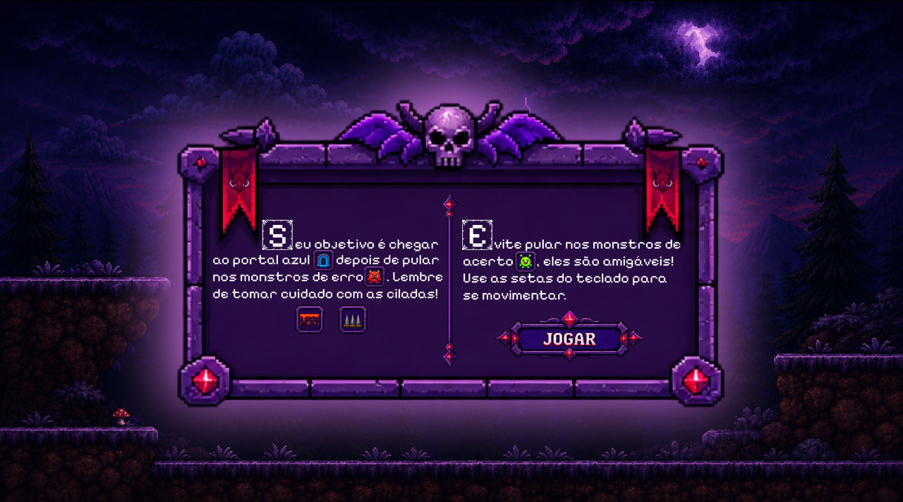
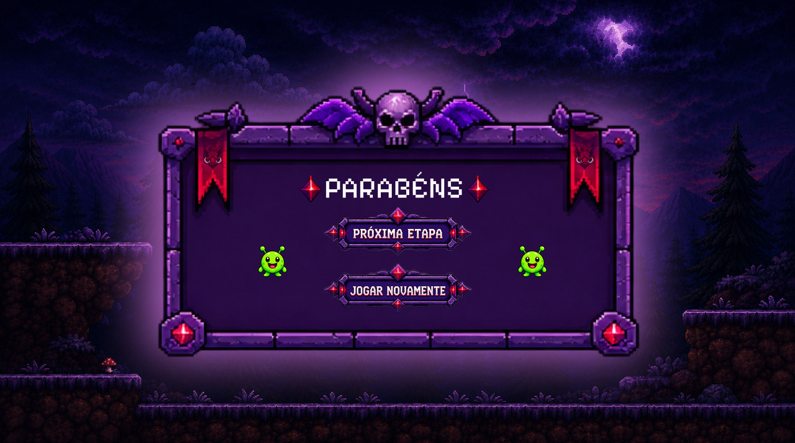
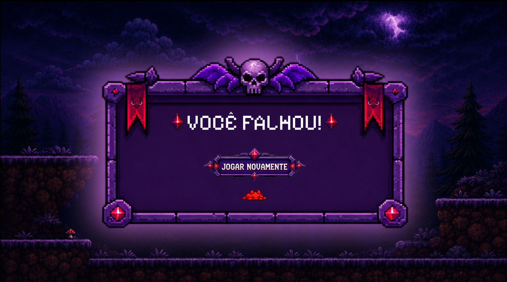
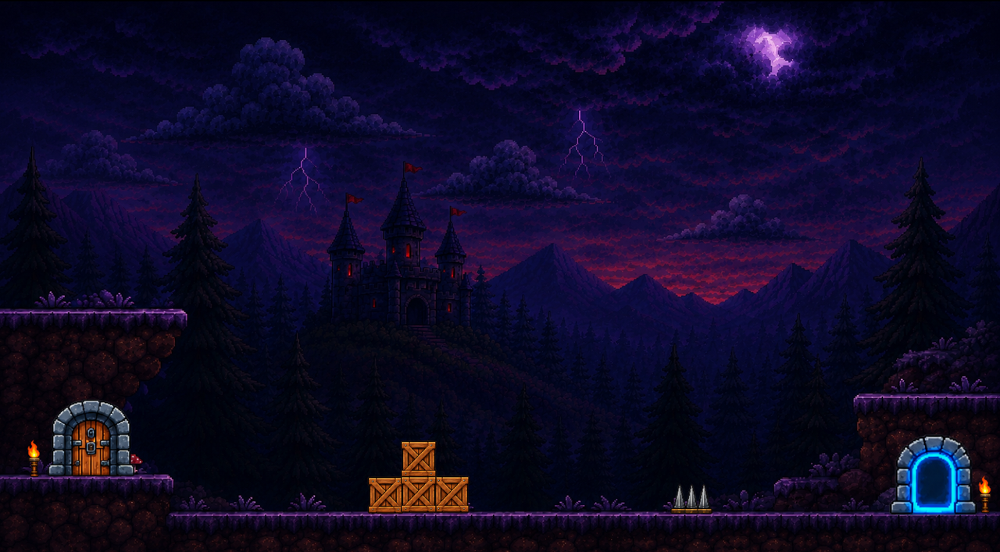
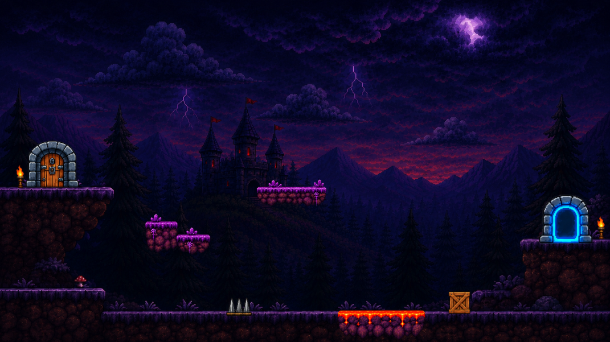
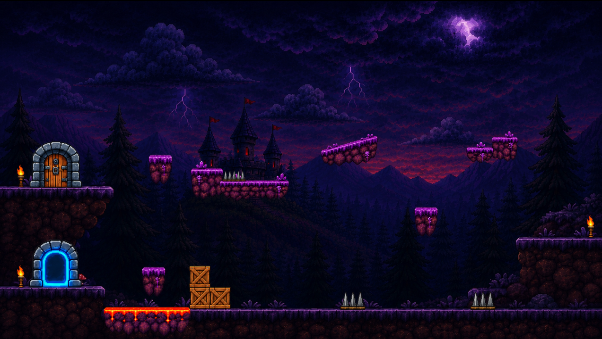
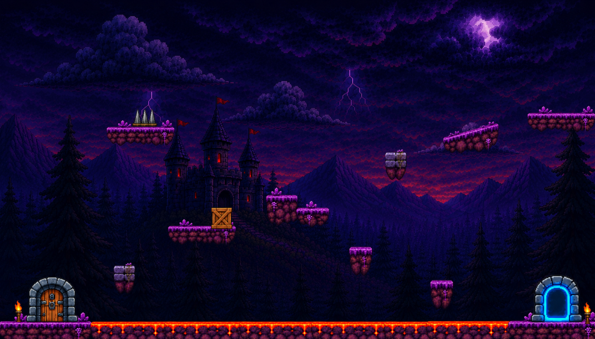
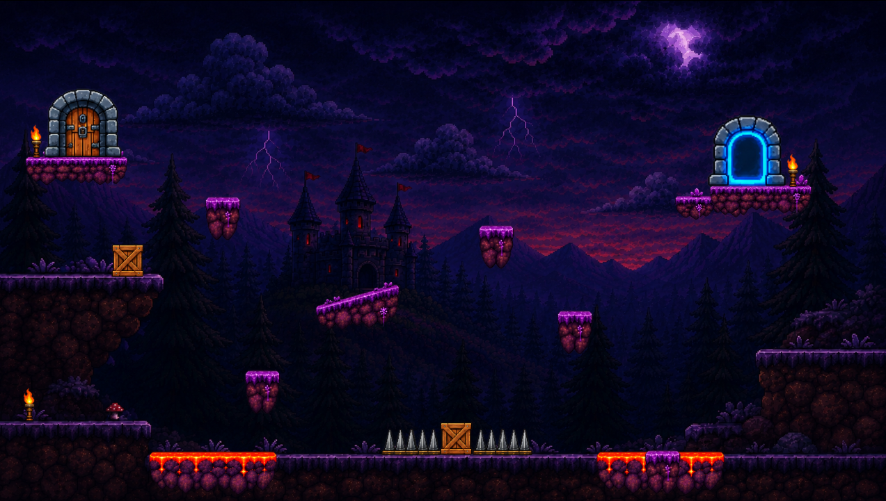

# Documento de Engenharia de Software: Fase 5, Castelo dos Erros Léxicos

| Campo | Valor |
|---|---|
| Grupo | 3 |
| Fase | 5, Castelo dos Erros Léxicos (`fase5_erroLexico`) |
| Tema | Identificação de caracteres inválidos e erros léxicos |
| Versão | 3.0 |
| Data | 31 de agosto de 2026 |

**Integrantes e funções**

| Integrante | Função |
|---|---|
| Anna | Líder e Designer UI/UX |
| Vitória | Programadora e Testes |
| Sabryna | Conteúdo Pedagógico |
| Sophia | Documentação |

---

## 1. Descrição Geral e Objetivos Pedagógicos

### 1.1 Visão Geral da Fase

O Castelo dos Erros Léxicos é a quinta fase do Compiler Edu Game. O jogador chega a ela após a Floresta da AST e assume o papel do analisador léxico: sua missão é eliminar do código os símbolos que não pertencem ao alfabeto da linguagem, preservando intactos os elementos válidos.

A fase é um jogo de plataforma 2D dividido em cinco níveis progressivos. Em cada nível, uma linha de código em C é exibida no alto do cenário, e os monstros distribuídos pelo mapa representam elementos léxicos relacionados a ela:

* **Monstros inválidos (vermelhos)** carregam símbolos que não fazem parte do alfabeto da linguagem, como `@` e `#`. O jogador deve derrotá-los saltando sobre eles.
* **Monstros válidos (verdes)** carregam tokens legítimos daquela linha de código, como `int`, `printf`, `return` e `;`. Eles não devem ser atacados: saltar sobre um deles custa uma vida ao jogador.

O portal de saída permanece fechado até que todos os monstros inválidos do nível sejam derrotados. Só então o jogador pode atravessá-lo e avançar. O cenário também contém obstáculos ambientais, como espinhos e lava, que causam dano por contato.

O jogador dispõe de três vidas, exibidas no HUD comum do jogo. Ao perder todas, a fase é encerrada em derrota, com a opção de tentar novamente a partir do início do nível.

### 1.2 Conceito de Compiladores Abordado

A fase trabalha a Análise Léxica e, de forma específica, a detecção de erros léxicos.

Um erro léxico ocorre quando o analisador léxico (scanner) encontra um caractere ou uma sequência de caracteres que não corresponde a nenhum padrão válido de token definido pela linguagem. É o caso de símbolos como `@` ou `#` fora de um contexto válido.

O objetivo pedagógico é que o jogador aprenda a diferenciar um token válido de um símbolo que viola as regras lexicais, associando essa distinção a uma ação de jogo direta e memorável: destruir o que o compilador rejeitaria e preservar o que ele aceitaria.

A exibição de uma linha de código real em cada nível reforça o vínculo entre a mecânica e o conteúdo. O jogador vê o código que o scanner leria e identifica, no cenário, os intrusos que impediriam essa leitura.

**Fronteira com outras fases.** Esta fase trata exclusivamente de erros léxicos, ou seja, símbolos que o scanner não consegue sequer transformar em token. Erros de estrutura, como parênteses não fechados ou comandos incompletos, são erros sintáticos e pertencem à Fase 6, Fortaleza dos Erros Sintáticos.

---

## 2. Especificação de Requisitos

### 2.1 Requisitos Funcionais (RF)

| ID | Descrição | Prioridade | Implementação |
|---|---|---|---|
| RF-01 | O jogo deve exibir uma tela de abertura antes do início da fase. | Alta | `introducao.tscn`, acionada pelo menu principal |
| RF-02 | O sistema deve distinguir elementos léxicos válidos de inválidos e representá-los visualmente de forma inequívoca. | Alta | `monstroValido.tscn` e `monstroInvalido.tscn` |
| RF-03 | O jogo deve permitir que o jogador controle o personagem e derrote os monstros inválidos saltando sobre eles. | Alta | `monstroInvalido.gd` |
| RF-04 | O jogo deve penalizar o jogador quando ele atingir um monstro válido, descontando uma vida. | Alta | `monstroValido.gd` |
| RF-05 | O sistema deve manter o portal de saída fechado até que todos os monstros inválidos do nível sejam derrotados. | Alta | `nivel.gd`, função `abrir_portal()` |
| RF-06 | O jogo deve controlar um sistema de vidas, reduzindo uma vida a cada dano recebido e exibindo o total no HUD. | Alta | `jogador.gd` e `GameManager` |
| RF-07 | O jogo deve encerrar a fase em derrota quando as vidas chegarem a zero, oferecendo a opção de tentar novamente. | Alta | `nivel.gd`, função `_on_jogador_morreu()` |
| RF-08 | O cenário deve conter obstáculos ambientais que causam dano ao jogador. | Média | `perigo.gd` |
| RF-09 | O jogo deve conduzir o jogador por cinco níveis progressivos e exibir uma tela de conclusão ao final. | Alta | `nivel.gd`, função `_proximo_nivel()` |
| RF-10 | O jogo deve permitir pausar a partida a qualquer momento, retomar a partida ou retornar ao menu principal. | Média | Ação `pause` e menu do HUD |
| RF-11 | O sistema deve calcular a pontuação com base nos monstros inválidos derrotados e nos erros cometidos. | Alta | `GameManager` |
| RF-12 | O jogo deve exibir mensagens de retorno na tela a cada ação relevante do jogador. | Alta | `hud.set_feedback()` |
| RF-13 | O jogo deve delimitar a área jogável, impedindo que o personagem saia do cenário. | Média | Nó `paredes` em cada nível |
| RF-14 | O jogo deve emitir efeitos sonoros para as ações do jogador e para os eventos da fase. | Média | `SoundManager` |
| RF-15 | O jogo deve registrar a conclusão da fase na progressão global, marcando o cartão correspondente no menu. | Alta | `GameManager.complete_phase(5, ...)` |

### 2.2 Requisitos Não Funcionais (RNF)

| ID | Descrição | Categoria | Implementação |
|---|---|---|---|
| RNF-01 | A fase deve ser desenvolvida em GDScript, sobre a versão do Godot padronizada para o projeto (Godot 4.5). | Padrão técnico | `config/features` em `project.godot` |
| RNF-02 | A detecção de colisão entre o personagem e os monstros deve ocorrer sem atraso perceptível. | Desempenho | Nós `Area2D` com sinal `body_entered` |
| RNF-03 | Os controles devem usar ações nomeadas do mapa de entrada, e não teclas fixas em código. | Manutenibilidade | Ações `esquerda`, `direita`, `pular` e `pause` |
| RNF-04 | A fase deve manter a identidade visual e o HUD do restante do jogo. | Usabilidade | Instância de `scenes/common/game_hud.tscn` |
| RNF-05 | A fase deve alimentar a progressão global do jogo por meio do autoload `GameManager`. | Integração | Sessão, pontuação, vidas e conclusão |
| RNF-06 | Os efeitos sonoros devem ser reproduzidos pelo serviço central de áudio, sem nós de som próprios da fase. | Manutenibilidade | Autoload `SoundManager` |
| RNF-07 | Os elementos léxicos devem ser reutilizáveis entre os níveis, sem duplicação de código. | Manutenibilidade | Cenas `monstroValido.tscn` e `monstroInvalido.tscn` com a propriedade exportada `caractere` |

### 2.3 Requisitos Pedagógicos (RP)

| ID | Descrição | Mapeamento no jogo |
|---|---|---|
| RP-01 | Cada nível deve exibir a linha de código à qual os elementos léxicos se referem. | Rótulo no alto do cenário |
| RP-02 | O objetivo pedagógico da fase deve estar declarado na tela durante toda a partida. | Subtítulo do HUD: "NÍVEL N: ELIMINE APENAS MONSTROS COM CARACTERES INVÁLIDOS" |
| RP-03 | O jogo deve confirmar o acerto ao eliminar um monstro inválido e informar quantos restam. | Mensagem "Monstro inválido eliminado! Restantes: N" |
| RP-04 | O jogo deve avisar o jogador quando ele cometer um erro. | Mensagem "Cuidado! Você perdeu uma vida." |
| RP-05 | O jogo deve sinalizar o progresso quando o objetivo do nível for cumprido. | Mensagem "Portal liberado! Entre no portal para avançar." |
| RP-06 | Ao concluir a fase, o jogo deve reconhecer o desempenho do jogador. | Tela de conclusão com o total de pontos obtidos |

---

## 3. Especificação da Mecânica (Game Design)

### 3.1 Mecânica Principal

O jogador controla uma personagem de plataforma que corre, salta e atravessa plataformas suspensas. A ação central é o salto sobre a cabeça do monstro, que produz efeitos opostos conforme o alvo.

| Alvo | Ação do jogador | Resultado |
|---|---|---|
| Monstro inválido (`@`, `#`) | Saltar sobre ele | O monstro executa a animação de derrota e é removido. O jogador quica para cima, ganha pontos e o contador de inválidos restantes diminui. |
| Monstro válido (`int`, `printf` e outros) | Saltar sobre ele | O jogador perde uma vida e retorna à posição inicial do nível. O monstro permanece no cenário. |
| Espinhos e lava | Encostar | O jogador perde uma vida e retorna à posição inicial. |
| Portal | Atravessar | Responde apenas depois que todos os inválidos foram derrotados. Leva ao próximo nível. |

**Condição de colisão.** O dano do monstro válido ocorre exclusivamente quando o jogador cai sobre ele, ou seja, quando está acima do monstro e com velocidade vertical positiva. Encostar lateralmente ou por baixo não causa dano. A mesma condição vale, de forma simétrica, para derrotar um monstro inválido.

### 3.2 Elementos da Fase

* **Personagem jogável.** Velocidade 250, força de pulo 575 e gravidade 1200, com animações `parado`, `andar` e `pular`.
* **Monstro inválido.** Porta um símbolo fora do alfabeto da linguagem e possui animações de vivo e de derrotado.
* **Monstro válido.** Porta um token legítimo da linha de código do nível.
* **Espinhos e lava.** Obstáculos ambientais que causam dano por contato.
* **Portal.** Saída do nível, inicialmente inerte.
* **Paredes.** Delimitam a área jogável nas laterais e no topo.
* **Rótulo de código.** Linha de código em C exibida no cenário.
* **HUD comum.** Título da fase, objetivo do nível, vidas, pontuação, mensagens de retorno e menus de pausa, derrota e conclusão.

### 3.3 Regras de Progressão

* **Vitória do nível.** Derrotar todos os monstros inválidos e atravessar o portal.
* **Vitória da fase.** Concluir os cinco níveis, o que exibe a tela de conclusão com o total de pontos.
* **Derrota.** Perder as três vidas. O HUD exibe a tela de derrota, e a opção de tentar novamente reinicia o nível, restaura as vidas e desfaz os pontos provisórios da tentativa.
* **Invulnerabilidade temporária.** Após receber dano, o jogador fica 0,7 segundo imune, o que evita a perda encadeada de vidas.
* **Pausa.** A tecla `Esc` interrompe a partida e desabilita os controles do personagem, permitindo retomar ou voltar ao menu principal.

### 3.4 Sistema de Pontuação

A pontuação é controlada pelo autoload `GameManager` e utiliza as mesmas constantes das demais fases do jogo, o que garante consistência na progressão global.

| Ação do jogador | Efeito | Constante |
|---|---|---|
| Derrotar um monstro inválido | +10 pontos | `CORRECT_POINTS` |
| Atingir um monstro válido ou um obstáculo | 5 pontos de penalidade e uma vida | `MISTAKE_PENALTY` |
| Concluir a fase | +50 pontos | `PHASE_COMPLETE_POINTS` |
| Concluir a fase sem cometer erros | +30 pontos de bônus | `FLAWLESS_POINTS` |
| Sequência de acertos consecutivos | Bônus progressivo | `_combo_bonus()` |

---

## 4. Arquitetura e Modelagem no Godot

### 4.1 Estrutura de Cenas

Estrutura de um nível, conforme `scenes/fase5_erroLexico/niveis/nivel1.tscn`:

```text
Nivel1 (Node2D)                          [nivel.gd]
├── Cenario (Node2D)
│   ├── Sprite2D                         plano de fundo do castelo
│   ├── TextureRect                      painel do codigo
│   ├── Label                            "int idade = 10;"
│   ├── Plataforma (StaticBody2D)        solo e plataformas suspensas
│   ├── Espinho (Area2D)                 [perigo.gd]
│   └── Portal (Area2D)                  monitoring = false ate ser liberado
├── Jogador (CharacterBody2D)            [jogador.gd]
│   ├── AnimatedSprite2D                 parado / andar / pular
│   ├── CollisionShape2D
│   └── Area2D/CollisionShape2D
├── Monstros (Node2D)
│   ├── MonstroInvalido  (CharacterBody2D)  [monstroInvalido.gd]
│   ├── MonstroInvalido2 (CharacterBody2D)  [monstroInvalido.gd]
│   ├── MonstroValido    (CharacterBody2D)  [monstroValido.gd]
│   └── MonstroValido2   (CharacterBody2D)  [monstroValido.gd]
└── paredes (StaticBody2D)
    ├── paredeEsquerda (CollisionShape2D)
    ├── paredeSuperior (CollisionShape2D)
    └── paredeDireita  (CollisionShape2D)
```

O HUD não é montado na cena do nível. Ele é instanciado em tempo de execução por `nivel.gd`, a partir de `scenes/common/game_hud.tscn`, e configurado com o título da fase e o objetivo do nível.

**Cenas e scripts da fase**

| Arquivo | Papel |
|---|---|
| `niveis/nivel1.tscn` a `niveis/nivel5.tscn` | Os cinco níveis da fase, todos com o script `nivel.gd` |
| `jogador.tscn` | Personagem jogável, reutilizado em todos os níveis |
| `monstroValido.tscn` | Elemento léxico válido |
| `monstroInvalido.tscn` | Elemento léxico inválido |
| `introducao.tscn` | Tela de abertura da fase |
| `nivel.gd` | Regras do nível, HUD, portal, pausa e progressão |
| `jogador.gd` | Movimentação, animação, dano e invulnerabilidade |
| `monstroValido.gd` | Penalidade ao ser atingido |
| `monstroInvalido.gd` | Derrota, animação e pontuação |
| `perigo.gd` | Dano por contato com obstáculos do cenário |
| `global.gd` | Guarda o último nível jogado |

### 4.2 Fluxo Lógico da Fase

```text
Menu Principal
     |  preparar_fase(5) e carrega introducao.tscn
     v
introducao.tscn  --[botao Jogar]-->  nivel1
     |
     v
+------------------------ nivelN ------------------------+
| 1. nivel.gd abre a sessao da fase no GameManager       |
| 2. Cria o HUD e conta os monstros invalidos            |
| 3. Portal inicia fechado (monitoring = false)          |
| 4. O jogador explora, salta e enfrenta os monstros     |
|      invalido derrotado: +10 pontos, contador diminui  |
|      valido atingido:    penalidade e uma vida         |
|      espinho ou lava:    penalidade e uma vida         |
| 5. contador == 0: abrir_portal()                       |
| 6. jogador entra no portal: proximo nivel              |
+--------------------------------------------------------+
     |                                  |
     | vidas == 0                       | apos o nivel 5
     v                                  v
HUD: tela de derrota              GameManager.complete_phase(5)
     |  tentar novamente                |
     +--------> nivelN                  v
                                  HUD: tela de conclusao
```

### 4.3 Integração com os Autoloads

**GameManager.** A fase abre a sessão ao carregar um nível, cria um ponto de restauração e registra cada evento relevante:

| Evento na fase | Chamada |
|---|---|
| Início do nível | `begin_phase(5)` ou `start_new_session(5)` |
| Ponto de restauração | `create_checkpoint()` |
| Monstro inválido derrotado | `register_correct_action()` |
| Dano recebido | `register_mistake("dano", true)` |
| Tentar novamente | `rollback_to()`, `reset_lives()` e `begin_phase(5)` |
| Voltar ao menu | `abandon_phase()` |
| Conclusão do nível 5 | `complete_phase(5, not phase_had_mistake)` |

A chamada a `complete_phase` é o que marca a fase como concluída no menu principal e libera o carimbo de conclusão no cartão da Fase 5.

**SoundManager.** Todo o áudio da fase é reproduzido pelo serviço central:

| Evento | Chamada |
|---|---|
| Salto do jogador | `play_jump()` |
| Passos | `play_footstep()` |
| Dano recebido | `play_hurt()` |
| Monstro válido atingido | `play_error()` |
| Monstro inválido derrotado | `play_confirmation()` |
| Início do nível e abertura do portal | `play_portal()` |

**Global.** Autoload próprio da fase, definido em `scripts/fase5_erroLexico/global.gd`. Guarda o número do último nível jogado, usado para retomar a partida no ponto correto.

### 4.4 Decisões Técnicas

**Classificação léxica por cena.** A distinção entre válido e inválido é determinada pela cena instanciada no nível, e o símbolo exibido vem da propriedade exportada `caractere`. A solução mantém os níveis puramente visuais: montar um novo nível não exige escrever código, apenas posicionar monstros e preencher o campo `caractere`.

**HUD instanciado em tempo de execução.** O HUD não é montado dentro de cada nível. `nivel.gd` instancia `scenes/common/game_hud.tscn` no carregamento e conecta os sinais de pausa, retomada, menu, nova tentativa e avanço. Isso garante que os cinco níveis compartilhem a mesma interface e que ela acompanhe qualquer alteração feita no HUD comum do projeto.

**Controle de dano com invulnerabilidade.** O personagem possui um período de 0,7 segundo de imunidade após receber dano, além do reposicionamento na entrada do nível. A medida evita que uma única colisão mal resolvida consuma todas as vidas.

**Progressão por troca de cena.** Cada nível é uma cena independente, e o avanço ocorre por `change_scene_to_file`. Os níveis não compartilham estado entre si: o progresso da fase é mantido pelo `GameManager`, e o número do nível corrente é guardado no autoload `Global`.

---

## 5. Conteúdo Pedagógico dos Níveis

Cada nível apresenta uma linha de código em C e distribui pelo cenário os elementos léxicos correspondentes.

| Nível | Código exibido | Elementos válidos (preservar) | Elementos inválidos (derrotar) |
|---|---|---|---|
| 1 | `int idade = 10;` | `int`, `idade` | `@`, `#` |
| 2 | `printf("Olá, mundo");` | `printf`, `;` | `@`, `#` |
| 3 | `return true;` | `true`, `return` | `@`, `#` |
| 4 | `float dinheiro = 67.28;` | `float` | `@` |
| 5 | `printf("%f", dinheiro);` | `dinheiro` | `@`, `#` |

**Justificativa didática.** Os elementos válidos cobrem as principais categorias léxicas trabalhadas na disciplina: palavras-chave (`int`, `float`, `return`), identificadores (`idade`, `dinheiro`), funções da biblioteca padrão (`printf`), literais (`true`) e delimitadores (`;`). Os inválidos (`@` e `#`) são símbolos que, fora de uma diretiva de pré-processador ou de uma cadeia de caracteres, não pertencem ao alfabeto da linguagem e seriam rejeitados pelo analisador léxico.

A dificuldade cresce ao longo dos níveis pela complexidade do trajeto e pela posição dos monstros, e não pela troca dos símbolos. O jogador consolida o mesmo critério de decisão em contextos de código cada vez mais completos, do comando de declaração simples até a chamada de função com especificador de formato.

---

## 6. Plano e Casos de Teste

| ID | Requisito | Ação realizada | Resultado esperado |
|---|---|---|---|
| CT-01 | RF-01 | Iniciar a fase pelo cartão do menu principal | A tela de abertura é exibida antes da jogabilidade |
| CT-02 | RF-03, RF-11 | Saltar sobre um monstro inválido | O monstro executa a animação de derrota, é removido, o jogador quica e a pontuação aumenta |
| CT-03 | RF-04, RF-06 | Saltar sobre um monstro válido | Uma vida é descontada no HUD e o jogador retorna à posição inicial |
| CT-04 | RF-04 | Encostar lateralmente em um monstro válido | Nenhum dano é causado, pois o dano exige queda sobre o monstro |
| CT-05 | RF-05 | Tentar atravessar o portal com monstros inválidos vivos | O portal não responde e o jogador permanece no nível |
| CT-06 | RF-05, RF-09 | Derrotar todos os inválidos e entrar no portal | O jogo avança para o nível seguinte |
| CT-07 | RF-08 | Encostar nos espinhos ou na lava | Uma vida é descontada e o jogador retorna à posição inicial |
| CT-08 | RF-06 | Receber dois danos em menos de 0,7 segundo | Apenas uma vida é descontada, por efeito da invulnerabilidade temporária |
| CT-09 | RF-07 | Perder as três vidas | A tela de derrota é exibida e a opção de tentar novamente reinicia o nível com as vidas restauradas |
| CT-10 | RF-09, RF-15 | Concluir o nível 5 | A tela de conclusão é exibida com o total de pontos e o cartão da Fase 5 passa a constar como concluído no menu |
| CT-11 | RF-10 | Pressionar `Esc` durante a partida | O menu de pausa é exibido e os controles do personagem são desabilitados |
| CT-12 | RF-10 | Escolher "voltar ao menu" com a partida pausada | O jogo retorna ao menu principal e a sessão da fase é encerrada |
| CT-13 | RF-12 | Derrotar um monstro inválido com outros ainda vivos | O HUD exibe a quantidade de inválidos restantes |
| CT-14 | RF-13 | Conduzir o personagem até os limites do cenário | O personagem é contido pelas paredes e não sai da área jogável |
| CT-15 | RF-14 | Executar salto, dano e derrota de monstro | Cada evento reproduz o efeito sonoro correspondente |

---

## 7. Matriz de Responsabilidades (RACI)

Definição dos papéis:

* **R (Responsável).** Executa a tarefa.
* **A (Aprovador).** Valida e responde pelo resultado final. Apenas um por atividade.
* **C (Consultado).** Fornece apoio técnico ou pedagógico durante a tarefa.
* **I (Informado).** É notificado sobre a conclusão da tarefa.

| Atividade | Anna | Vitória | Sabryna | Sophia |
|---|:---:|:---:|:---:|:---:|
| Modelagem das cenas no Godot                  | A | R | C | I |
| Programação da lógica de combate e vidas      | C | R / A | I | I |
| Integração com o GameManager e o SoundManager | C | R / A | I | I |
| Definição dos elementos léxicos de cada nível | I | C | R / A | C |
| Elaboração dos textos exibidos ao jogador     | C | I | R / A | C |
| Execução do plano de testes                   | I | R / A | C | C |
| Documentação de engenharia da fase            | C | C | C | R / A |
| Coleta de evidências da AEX                   | I | C | I | R / A |

---

## 8. Histórico de Revisões

| Data | Versão | Descrição da alteração | Autor |
|---|---|---|---|
| 10/08/2026 | 1.0 | Criação inicial do documento de engenharia da fase | Sophia |
| 25/08/2026 | 1.1 | Registro da mecânica de monstros, do sistema de vidas e da tela de abertura | Sophia |
| 31/08/2026 | 2.0 | Revisão do documento contra o código-fonte: correção da mecânica principal, inclusão dos cinco níveis e do conteúdo léxico de cada um, e correção da estrutura de cenas | Sophia |
| 31/08/2026 | 3.0 | Versão final: adoção da estrutura de documentação por fase, atualização para o HUD comum, integração com o GameManager e o SoundManager, pausa, delimitação do cenário e ampliação do plano de testes | Sophia |

---

## 9. Anexos

### 9.1 Arquivos da Fase

| Categoria | Caminho |
|---|---|
| Cenas     | `scenes/fase5_erroLexico/`        |
| Níveis    | `scenes/fase5_erroLexico/niveis/` |
| Scripts   | `scripts/fase5_erroLexico/`       |
| Arte/cenários | `assets/fase5_erroLexico/`    |

### 9.2 Registro Visual

As imagens da fase estão em `docs/fase5_erroLexico/img/`. O registro das atividades de extensão está em [evidencias_aex.md](evidencias_aex.md).

**Telas da fase**

Tela de abertura, com o objetivo e as instruções de controle apresentados ao jogador antes do início da partida.



Tela de conclusão, exibida após o nível 5.



Tela de derrota, exibida quando o jogador perde todas as vidas.



**Cenários dos cinco níveis**

Cada cenário apresenta o portal de entrada à esquerda, o portal de saída à direita e os obstáculos ambientais distribuídos pelo trajeto. Os monstros, o personagem e o HUD são posicionados sobre esses cenários em tempo de execução.

| Nível | Cenário |
|---|---|
| 1 |  |
| 2 |  |
| 3 |  |
| 4 |  |
| 5 |  |

A progressão visual acompanha a progressão de dificuldade: o nível 1 se desenvolve quase todo no solo, enquanto os níveis seguintes introduzem plataformas suspensas, trechos de lava e sequências de espinhos que exigem saltos mais precisos entre um monstro e outro.

---

Compiler Edu Game. Atividade Curricular de Extensão (AEX), Ciência da Computação, Universidade Estadual do Norte do Paraná.
